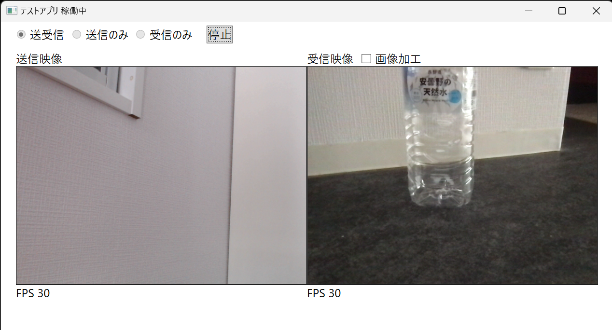

# webrtc-test

- WebRTCを使ったGUIアプリです。1対1の双方向の映像通信が行えます。
- 映像のみです、音声はありません。
- シグナリングサーバーは [Ayame](https://github.com/OpenAyame/ayame) を使用しております。
- Windows用です。

### 開発環境
- Windows 11
- Visual Studio 2022
- C# WPF
- Microsoft.MixedReality.WebRTC（WebRTCのライブラリ）
- WebSocketSharp (WebSocketのライブラリ)

### ビルド
- Windows環境で、Visual Studio を使って行ってください。

### 実行方法
- Windows 環境のみで実行できます。
- Ayame の情報を test.config に記述し、実行ファイル（Test.exe）と同じフォルダに置く必要があります。（詳細は別途）
- 起動は、Test.exe ファイルを実行してください。
- STUN/TURN/シグナリングサーバーは、[Ayame Labo](https://ayame-labo.shiguredo.app/) を使用すると、自前で用意しなくてもすぐに動作の確認が行えます。
- 「カメラに接続できない」、「mrwebrtc.dllのロード失敗」など、起こった場合、実行ファイル (Test.exe) と同じフォルダに mrwebrtc.dll をコピーしてください。mrwebrtc.dll は、このプロジェクトのbinフォルダのずっと下、runtimes/winXX-XXX/native の下あたりに自動的につくられます。特にWindows11環境でこのエラーは起こります。

### 操作方法
- 「送受信」「送信のみ」「受信のみ」のどれかを選んで、「開始」ボタンを押してください。
- 相手と接続が完了し通信が始まると、上部に「稼働中」と表示されます。

### 問題点
- 自分と相手で、このアプリをそれぞれ起動するとき、先に「開始」したアプリの映像が送信されない場合があります。
(Answer時のSDPデータが、a=inactiveになってしまう)
- 後から「開始」したアプリの映像送信はうまくいきます。

### 以上
